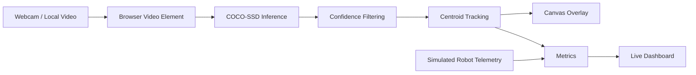

# Robot Vision System

A browser-based computer vision and robotics perception demo that turns camera/video input into **real object detections, lightweight tracking, performance metrics, and robot telemetry** in a live dashboard.

> **Portfolio goal:** demonstrate an end-to-end perception workflow without pretending that a physical robot or cloud backend is connected. Computer vision inference is real; robot telemetry is explicitly simulated.

## What it demonstrates

- Real-time webcam input through the browser
- Local video-file input for reproducible demos
- Object detection with **TensorFlow.js + COCO-SSD**
- Confidence thresholding and per-frame detections
- Lightweight centroid-based object tracking across frames
- Inference latency measurement
- Pipeline FPS measurement
- Detection confidence and object-count metrics
- Simulated robot battery, odometry, and network telemetry
- Live event/observability log
- Snapshot capture from the current video frame
- Responsive dashboard suitable for a portfolio demo

## Architecture



### Real vs simulated components

| Component | Status |
|---|---|
| Webcam / local video input | **Real** |
| Object detection | **Real** |
| Detection confidence | **Real model output** |
| Centroid tracking | **Real browser-side algorithm** |
| Latency measurement | **Real browser measurement** |
| FPS measurement | **Real browser measurement** |
| Robot battery | Simulated |
| Robot odometry | Simulated |
| Network telemetry | Simulated |
| Cloud storage / inference API | Not connected |
| Physical robot | Not required |

## Run locally

Because this project uses browser camera APIs and JavaScript modules loaded from CDNs, use a local HTTP server instead of opening `index.html` directly.

### Python

```bash
python -m http.server 8000
```

Open:

```text
http://127.0.0.1:8000/
```

### Node.js

```bash
npx serve .
```

Then open the URL printed by the server.

## How to test the pipeline

1. Start the local server.
2. Open the dashboard.
3. Click **Load video** and select a short MP4/WebM clip, or click **Start camera** and allow browser camera access.
4. Wait for the COCO-SSD model to load.
5. Verify that bounding boxes and labels appear over detected objects.
6. Verify that **Inference latency**, **Objects detected**, **Tracked objects**, and **Pipeline FPS** update.
7. Move an object through the scene and verify that the tracker keeps a track ID when possible.
8. Use **Capture snapshot** to export the current frame.
9. Click **Stop** and verify that the pipeline returns to the ready state.

## Technical notes

### Detection

The dashboard loads COCO-SSD with the lightweight MobileNet v2 base model in the browser. A confidence threshold of `0.55` is used to keep the visualization focused on stronger predictions.

### Tracking

COCO-SSD provides detections but does not provide persistent IDs. This project adds a small centroid tracker that matches detections of the same class between adjacent processed frames using Euclidean distance.

This is intentionally lightweight and is **not** presented as a production-grade multi-object tracker.

### Performance

The UI records:

- Per-frame model inference latency
- Approximate processed FPS
- Number of detections per frame
- Average confidence
- Number of active tracked objects

The browser and hardware influence these values, so they are measured at runtime rather than hardcoded.

## Project structure

```text
robot-vision-dashboard-main/
├── index.html
├── app.js
├── styles.css
├── Logo.png
├── Badges/
└── README.md
```

## Future production architecture

The current project deliberately stops at browser-side perception. A production deployment could replace or extend the input and telemetry layers with:

- RTSP/WebRTC robot camera streams
- Python/FastAPI inference service
- ONNX/TensorRT optimized models at the edge
- Real robot telemetry over MQTT or ROS 2
- Azure Blob Storage / IoT services
- Persistent detection and telemetry storage
- Alerting and observability infrastructure
- CI tests for the inference and tracking pipeline

These are future integrations, not features claimed as implemented in this repository.

## License

This project is provided as a portfolio and learning project.
